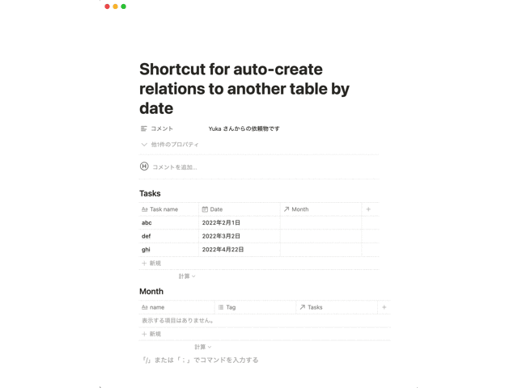
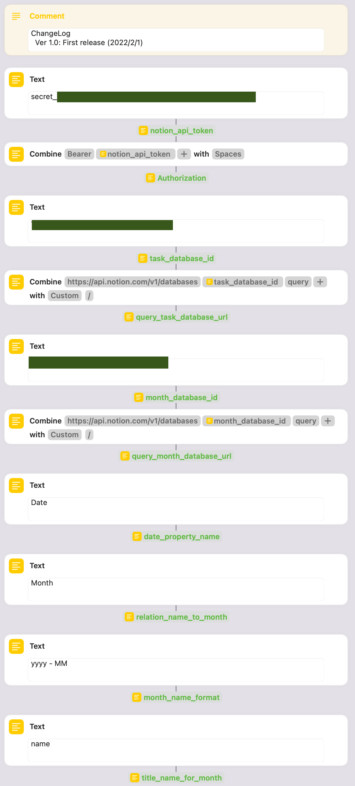
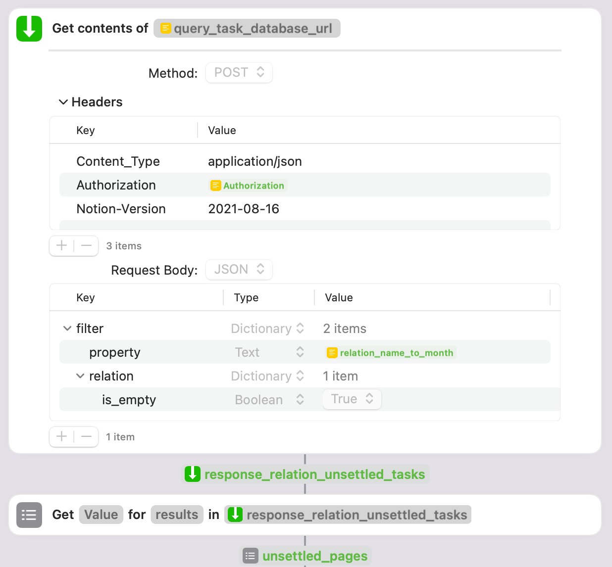
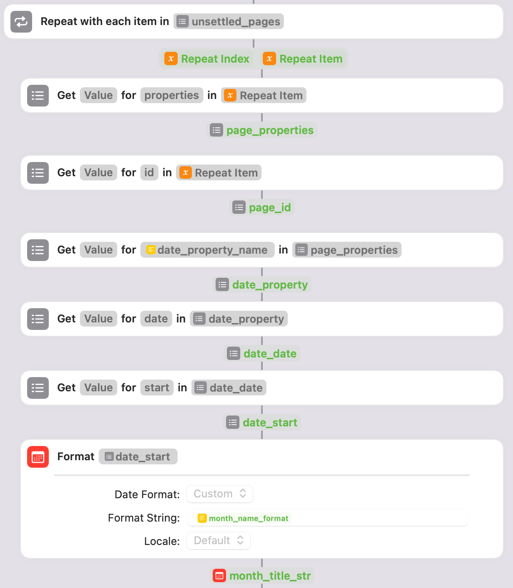
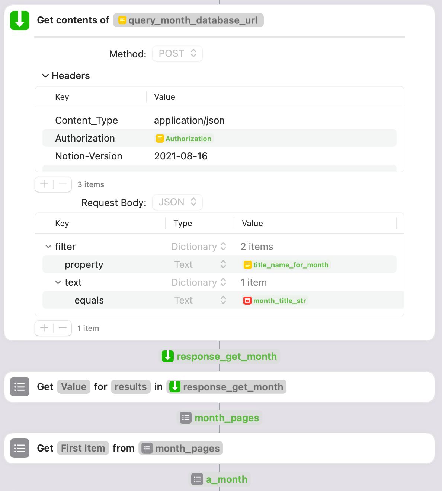
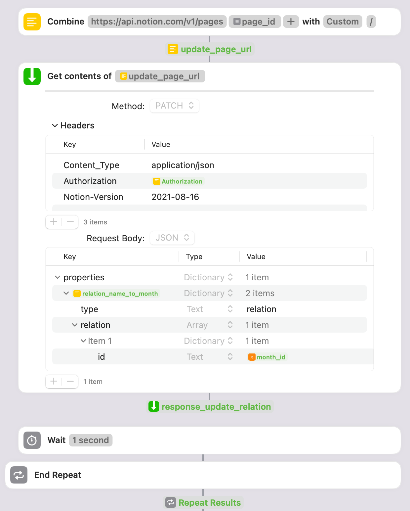

# notion-create-relations-shortcut-by-date

a shortcut for creating notion relations by date

## Demo

## Download

You can download this shortcut from here ->
[Download link](https://www.icloud.com/shortcuts/1da6c66f2c554514aa80ca557f5ade66)

Check my sample page for description -> [Sample notion page](https://hkob.notion.site/Shortcut-for-auto-create-relations-to-another-table-by-date-36d6346cfcdd48c59a1dcafcb74b5518)

## shortcut source

### 1. Variables settings

### 2. Obtain tasks whose relation property is empty

(Ver 1.0 First release (2022/2/1)

(Ver 1.1 Remove tasks that does not set date property (2022/2/1)

### 3. Generate a relation name from the date field of each task page

### 4. Obtain the month page

### 5. Create a month page unless exist it

### 6. Update the relation property of the task page

## ChangeLog

- Ver 1.1: Remove tasks that does not set date property (2022/2/1)
- Ver 1.0: First release (2022/2/1)
